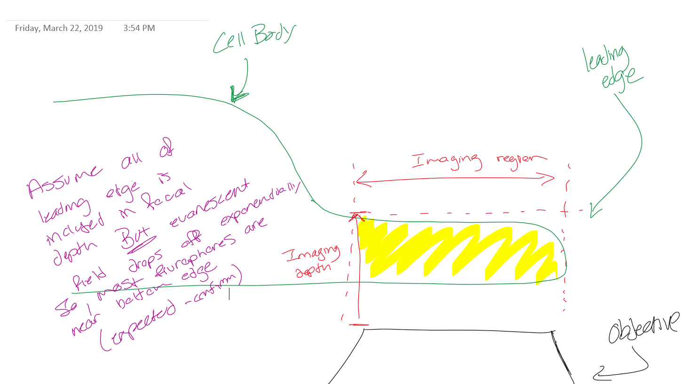
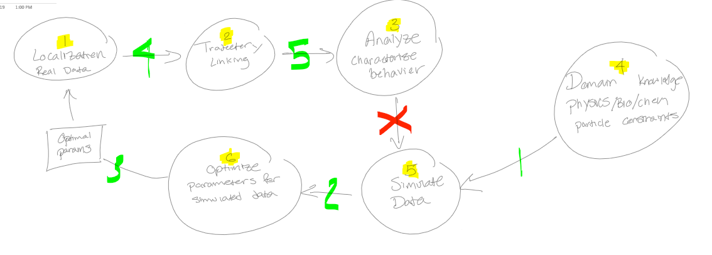
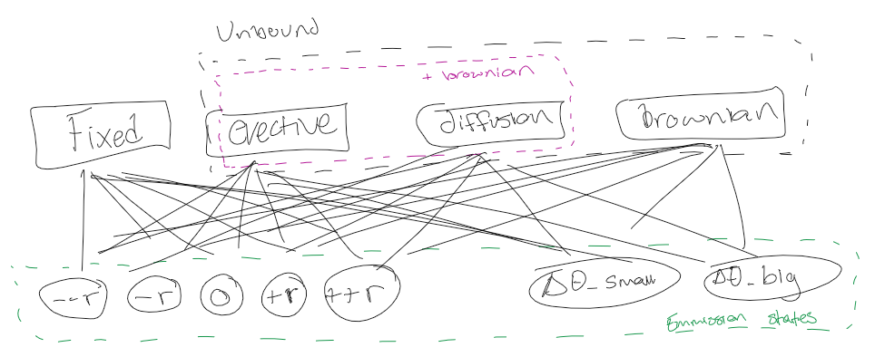
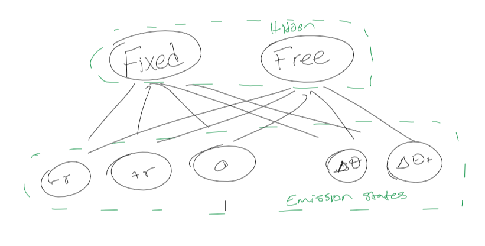

# Galbraith_Lab_SPT

# Overview

This file comprises the primary report for my rotation with the Galbraith Lab (Winter 2019) at Oregon Health and Science University. In it, I discuss background research, link important literature review, describe and link other relevant documentation, discuss future research ideas and make recommendations for single particle tracking.

The overarching research question motivating this research is:
> Is there a mechanism recycling actin other than diffusion?

### Project Goal: Identify or build an effective single particle tracking algorithm; create a "map of trajectories" representing actin molecules in live cell imaging by Total Internal Reflection Fluorescence (TIRF).

# Background

## General

Total Internal Reflection Imaging ([TIRF](https://en.wikipedia.org/wiki/Total_internal_reflection_fluorescence_microscope))  

Galbraith Lab Data Aquisition and specifics:   

- IRB # N/A
- File Naming Convention: "date_coverslip_experimentName_shutterTime_numFrames.tif"    
- Color Depth: 16-Bit 1-Channel (grey-scale)    
- Image Dimensions: Variable, 128-256 px square [256 px ~ 2.8 x 2.8 microns]  
- Pixels: 111 nm (square)  
- Shutter Length: variable [10ms-29ms] - see data naming convention   
- Shutter-closed interim: ~negligible   
- Focal Depth: ~200 nm   
- Excitation Depth: Commonly ~100 nm   
- Cell Type: Neuron   
- Sample source: Mouse  

$$ Diffusion \ Coefficient \ (D) = \frac{k_B \ T}{6 \pi na} \\ where: \ n = fluid \ viscosity \\ a = particle \ diameter \\ T = Temperature  $$

- Actin Diffusion Coefficient: 3 - 30 ??m^2/s [source](https://bionumbers.hms.harvard.edu/bionumber.aspx?id=112133)  
- Numerical Aperture: 1.47   
- Excitation wavelength: Depends on flurophore
- Emission wavelength: Depends on flurophore

Flurophore Molecule: "JF Tag" [Janelia Fluor](https://www.tocris.com/products/janelia-fluor-549-se_6147)  

Expected track duration (Particle fluorescence lifespan): "> 30 frames" ~ 30*[10-30]ms -> [3.0-9.0] seconds  

[Actin](https://en.wikipedia.org/wiki/Actin) Monomer:   
    - size: 67 x 40 x 37A  
    - Molecular Mass: 41785 Da  
    - isoelectric pt: 4.8  
    - net charge (pH=7): -7  

Cytoplasm Viscosity @ cell membrane: 1.1 +/- 0.2 cP (fibroblast) and 1.0 +/- 0.2 cP (MDCK) [source](https://www.ncbi.nlm.nih.gov/pmc/articles/PMC1225847/)  

Experiment Notes:   
G13RRAC - Actin monomer that cannot polymerize; Pseudo-innert particle to test evective flow  
LifeActRAC - Actin related protein; Actin binding protein.   

## Useful Links

[FSU Molecular Expressions](http://micro.magnet.fsu.edu/)   
[bio-numbers](https://bionumbers.hms.harvard.edu/)  
[Changes in single-molecule integrin dynamics linked to local cellular behavior](/Users/Nate/Box%20Sync/Galbraith_Research/mbc.e16-01-0018.pdf)  
[Coupling integrin dynamics to cellular adhesion behaviors](/Users/Nate/Box%20Sync/Galbraith_Research/bio036806.full.pdf)  
[Objective comparison of particle tracking methods](https://www.nature.com/articles/nmeth.2808)  
[Robust single-particle tracking in live-cell time-lapse sequences](https://www.nature.com/articles/nmeth.1237)  
   [u-track](https://github.com/DanuserLab/u-track) - matlab SPT software   
[TrackMate: An open and extensible platform for single-particle tracking](https://www.sciencedirect.com/science/article/pii/S1046202316303346)  
   [ImageJ plugin](https://imagej.net/TrackMate)  

[SpotOn](https://www.ncbi.nlm.nih.gov/pubmed/29300163) : Robust model-based analysis of single-particle tracking experiments with Spot-On.

- The experimental data is available [here](https://zenodo.org/record/834781)  
- The simulations are available in Matlab format [here](https://zenodo.org/record/835541)  
- The simulations are available in CSV format [here](https://zenodo.org/record/834787)  
- And supplementary software used for MSDiand vbSPT analysis as well as for generating the simulated data [here](https://zenodo.org/record/835171)  

User-friendly matlab GUI for SPT analysis : [TrackArt](https://www.ncbi.nlm.nih.gov/pmc/articles/PMC4021860/)  
Software for simulating SPT data : [SMeagol](https://www.ncbi.nlm.nih.gov/pmc/articles/PMC4965627/)  
Software for localization and simulated SPT images (no track information though) :  [thunderSTORM](https://www.ncbi.nlm.nih.gov/pmc/articles/PMC4207427/)  

Frame work for SPT development

- [TrackNTrace](https://www.nature.com/articles/srep37947)
    - [github](https://media.nature.com/original/nature-assets/srep/2016/161125/srep37947/extref/srep37947-s1.pdf)

# Deliverables Orginization

In this github repo, there should be [at minimum] the following items:

> **evans_SPT_lib.py** : The main library for developed software.
> **evans_recommended_SPT_tutorial.ipynb** : The document that outlines the recommended SPT analysis pipeline.
> **evans_trackpy_analysis.ipynb** : overview of explorative data analysis of SPT data using the trackpy package.

# Methods

## Overview

Results from Single Particle Tracking (SPT) are an inherently difficult to validate as there is, in most cases, no ground truth to test against. This limits verification and validation methods, in this report, we consider the following three approaches:

- Simulate Data
- Filter Results
- Manual annotation

**Manual annotation** is a common approach in a number of fields, however, the linking variability and significant time resources associated with manual annotation of single particle tracking make this an undersirable method. This is well discussed in literature and not commonly used in the field.

To **simulate data**, requires producing a ground truth of hypothetical (1) linked trajectories, (2) particle positions [in time] and (3) images. From these three components, an SPT algorithm can be tested by running localization and linking methods on the simulated images, and then comparing (2) and (3) to the SPT results. This is commonly done using a metric such as the [jacaard index](https://en.wikipedia.org/wiki/Jaccard_index) to summarize linking/localization accuracy. The underlying issue with this method is that simulated data itself takes a myriad of parameters and assumptions, many of which, we may not know, or cannot accurately simulate. This indicates that simulated data is at risk for significant bias, and may not reflect our real world data; In such a case, the reported accuracy of simulated data would not reflect accuracy of real data. One example of this, especially relevant to this rotation, is the assumption of brownian-motion / random-walk vs evective flow. In many literature simulations, data was simulated as random walk, and thus algorithm success is known to perform well in these cases, however, in evective flow a particle's behavior may change drastically, resulting in wildly different linking. This may produce results indicative of random walk when ground truth is evective. The important questions to ask when simulated data are:

- What assumptions does this simulation have?
- Do these assumptions fit the real-world / intended-purpose data? 
- When is good, good enough?
  - Analysis and summary metrics are the end-goal results of these tasks, so what linking accuracy is sufficient for our use-case?
  - How are the summary results affected by improper linking?

The second method of approaching high-fidelity data, is to filter the trajectories, using domain knowledge or fundamental constraints of the particle. An example of this is: it is very unlikely to see a particle lasting longer than X frames (variable; depends on flurophore), as flurophores have a probability of photobleaching. This method requires knowing characteristics of particle movement prior to the SPT task, which can be difficult in exploratory situations. Additionally, this does not guarantee proper linking, rather it merely increases our confidence in the results. Some potential track characteristics we can use for filtering are:

- Particle max speed
- Particle Expected speed / displacement
- Track localization features
  - intensity
  - standard deviation
  - xy uncertainty / size
- Track lifetime (# of active frames)

## Proposed Methods

#### Filter, Simulate, Refine

One of the earliest approaches we examined involved merging the methods above, and is illustrated in the image below.

This approach would start by using default algorithm parameters to produce baseline trajectories. These trajectories would then be filtered using domain knowledge, fundamental particle characteristics such as speed, lifespand, etc. The remaining trajectories would then be used to further characterize our expeceted particle behavior, producing assumptions / parameters that we could then apply to a simulated dataset, to more accurately emulate our real-world data. This simulated data would then be used to optimize the aglorithm parameters. Finally, the optimal parameters would be used in a second round of SPT on the original data.

There were a number of issues with this approach, both conceptually and in implementation. Conceptually, this method essentially uses each dataset to optimize itself, and would therefore almost certainly lead to overfitting. Moreover, this method requires a simulated data within the parameter space we define, which would mean programatically addressing:

- How do we characterize filtered particle behavior?
  - Which parameters are most valuable to characterize particle behavior
- How do we generate simulated data with similar particle behavior?
  - Producing simulated data that incorporates our the parameters that we've used to characterize particle behavior
- How do we optimize the parameter space of our simulated data?
  - This becomes intractable with a high number of parameters

Unfortunately, these hurdles are significant and pushes this approach outside the scope of our project, however, for a larger project, there may be solutions. There are software packages for simulation that would mitigate much of the work load, SMeagol, being top on that list.

#### Get easy-to-track data

Another concept to improve SPT reliability is to change our data acquistion methods to make SPT easier. There are a number of ways we could do this:

- **increasing flurophore intensity** will make SNR better and thus localization easier. However, there are limited number of flurophores to choose from, and many change the bound protein function, making results unreliable or misinterpreted.
- **decreasing shutter time**, this means we have more time points for each particle, which will make trajectory linking significantly easier, however, this will also decrease the signal intensity making localization more difficult. In a recent paper, it was shown that SNR of 4 was sufficient for accurate localization [???] and therefore shutter speed should be tuned to the minimum value to maintain a SNR >4. Ideally, this would be a real time analysis.
- **using low particle density** will make localization and linking much easier. However, conclusive results often require a large number of tracks, and so low particle densities may require far more experiments and is therefore ultimately intractable within our resource constraints.

One method we discussed was a microscope redesign and accompanying image processing that might result in more accurately tracked data. To do this, a beam splitter would be positioned in the image path, just before the CCD. The split image would be projected onto two separate sensors, where each sensor would take different shutter length images. One CCD would take rapid images, giving localization and temporal data, wheras the other sensor would take a long interval image, which would encode track information. An illustration of the technique is included below. One potential issue of this method is that splitting our image would halve the number of photons to each sensor, which may significantly decrease SNR.

# Results

The Software packages we examined.

## utrack

This method uses an approximation of Multiple Hypothesis Tracking (MHT) to link frames and allows merging, splitting, and skipped frames. Localization has a number of available methods including gaussian mixed model. Written in matlab. While MHT is a global optimization, the approximation used here does mean that it may approach local minimas.

Robust single-particle tracking in live-cell time-lapse sequences [link](https://www.nature.com/articles/nmeth.1237)  
   [u-track](https://github.com/DanuserLab/u-track)

## trackpy

A python package with a myriad of localization, tracking and diagnostic methods, extrememly useful for EDA. Tracking is built on sklearn's KDtree (nearest neighbor) and therefore does not allow merging, splitting or skipped frames. Simple, clean and easy to use. Also has some great methods for track analysis, such as drift calculation, diffusion constant calculatiuon and track vizualizations.

[github](https://soft-matter.github.io/trackpy/v0.3.2/)

For detailed analysis using this package, please see [evans_trackpy_analysis.pdf](./evans_trackpy_analysis.pdf).

## SMeagol

A simulation software package. [link](https://www.ncbi.nlm.nih.gov/pmc/articles/PMC4965627/)

There is a lot to unpack here, but has not been within the scope of this project.

## Trackntrace

[TrackNTrace](https://www.nature.com/articles/srep37947) is a fantastic matlab based framework for SPT pipeline development; This software allows a plug-and-play nature to the different components of SPT and allows for separate algorithms/packages be used for localization, refinement, and linking. Additionally, it allows for easy testing of different pipelines. The defaults include utrack and have excellent parameter tuning options. The software can be found at their [github](https://media.nature.com/original/nature-assets/srep/2016/161125/srep37947/extref/srep37947-s1.pdf). I found this package by far the most effective for a subjective and manual optimization of SPT, and I this software is what I recommend be used in future analysis unless additional research is done for further optimization.

# Discussion

## SPT Recommendation

From my time this quarter researching the available methods for Single Particle Tracking and their effectiveness, I recommend that current analysis be conducted using **TrackNTrace** and utrack as the linking method. I would further recommend that parameters be tuned manually, by subjective examination of localization and tracking performance using TrackNTrace. Track results from this can be further filtered by eliminating stubs (tracks of length 2-X, I'd suggest X ~ 10) and tracks longer than 45 (depending on shutter speed - we expect the average track length to be about 30 frames). Lastly, I would recommend that data quality be examined prior to analysis, and only use image sets with SNR > 4, as defined above, and low-mid density using subjectively measured density at this point; If we cannot distinguish local track accuracy by eye, then we must assume algorithm accuracy is highly suspect.

Furthermore, I recommend that track analysis be done using methods in the TrackPy package using the results from the pipeline documented above.

## SPT Results Analysis Recommendation

## Future Topics of Investigation

Develop a method of measuring local particle density to use as a data quality measurement. This would be useful in characterizing thresholds for acceptable/trusted datasets.   

There are a number of SPT software packages that we did not get to, and I think would be quite valuable for further research. These include:  

- [Tracking particles with large displacements using energy minimization](https://pubs.rsc.org/en/content/articlelanding/2017/sm/c6sm02011a#!divAbstract)
- [Automated tracking of colloidal clusters with sub-pixel accuracy and precision](https://iopscience.iop.org/article/10.1088/1361-648X/29/4/044001/meta)
[Bayesian analysis of single-particle tracking data using the nested-sampling algorithm: maximum-likelihood model selection applied to stochastic-diffusivity data](https://pubs.rsc.org/en/content/articlelanding/2018/cp/c8cp04043e#!divAbstract)
- [Scalable approximate Bayesian inference for particle tracking data](https://www.biorxiv.org/content/10.1101/276253v1)
- [Diatrack particle tracking software: Review of applications and performance evaluation.](https://www.ncbi.nlm.nih.gov/pubmed/28945316)

Additionally, in regard to SPT results analysis, there is an avenue of probablistic graphical modeling for causal inference that I would like to explore. In the most simplistic approach, I'd like to train Hidden Markov Models on separate experiments, then use these models to:

1) Filter bound/fixed flurophores vs free monomers
2) Compare experiment movement characteristics by analyzing the difference in emission probabilities between HMMs.

As an initial conception, I would convert track coordinates to polar with origin being at the estimated cell center (use cell membrane edge for estimation) then discretize track movements into +/- r bins (+r meaning track displacement towards cell membrane leading edge) and delta theta bins (directionality shouldn't matter since we're only interested in movement towards the membrane).

From here, there are two methods we could try. First, set the hidden states as [bound] and [unbound + evective + brownian] and [unbound + diffusion + brownian]. This would allow for different particles to exhibit different behavior, which would make sense in a comparmentalized conception of the cell or if the microfluidics of the cell are complex. This technique would be quite valuable in characterizing particle movement as either brownian or evective but is dependant on us being able to accurately estimate the probability emission states of evective, diffusion and brownian assumptions. This method would be useful, given data from an individual experiment, to characterize particle movement into each class type, which would allow for descriptions such as:

- EXP1 had 40% bound particles, 20% diffusion particles and 40% brownian motion particles
- EXP2 had 30% bound particles, 10% diffusion partciles, 30% brownian motion particles and 30% evective flow particles   

The second method, would be to set the hidden states as [bound] and [unbound] with the emission states being the discretized polar coordinates of our track data. We would then use the viterbi algorithm to estimate the emission probabilities from each *individual* dataset/experiment. We would then use the trained emission probabilities to compare the differences between experiments. An example of how this might be useful is: Given datasets from two experiments, with and without diffusion, we would train two HMMs and then compare the emission probabilities of our bound state. We would expect to see HMM_without_diffusion have unbound emission probabilities that match brownian motion, but if it instead shows drift, it'd be indicative of evective flow.

Lastly, these HMM models could be used as a generative model to produce simulation data characterized by real world data. This could be very useful for reducing bias and thereby increasing our confidence in accuracy measurements.

# Unanswered Questions

- what concentration gradient is expected? are there other (un-measured) actin-like particles that may increase the concetration gradient (and thus speed)

- If there is really no image interval (time between images) then why do we see such drastic particle position between frames but extremely good localization in-frame?
eg if a frame lasts 25 ms and the particle can be localized to an uncertainty of 5 microns, then how does the particle move >> 5ums between two frames (which should be negligibe time) ?
